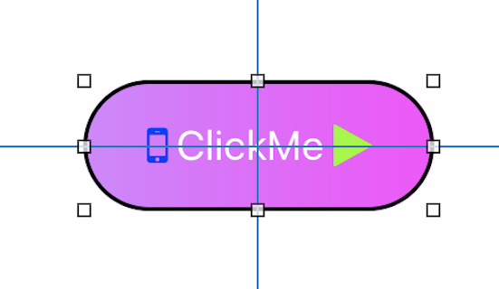
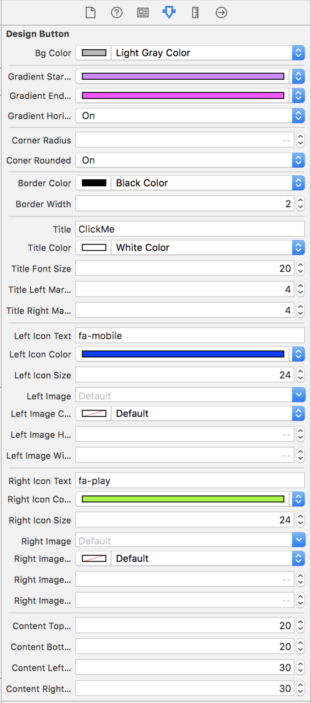

如何创建iOS自定义控件（进阶）

> 以前写过一个文章[《如何用Swift创建自定义iOS控件》](http://www.jianshu.com/p/6d73d3b16918)，文章主要以Swift语言讲解，图个新鲜。这次再写一个进阶的文章，重点讲一下如何制作可以和Xcode交互的控件，以及如何与AutoLayout系统交互。

我们以一个自定义按钮为出发点讲解，创建方法和[《如何用Swift创建自定义iOS控件》](http://www.jianshu.com/p/6d73d3b16918) 类似，也是基于Nib来创建我们的控件。Demo项目在Github上[这里](https://github.com/dourgulf/JCDesignButton), Demo还是有一定使用价值的，虽然还有很多需要完善的地方。

因为是进阶教程，就不再一步一步手把手教了，重点阐述一些疑惑和踩坑的地方。

1. 自定义控件如何与Xcode交互？

   * 属性前用IBInspectable修饰（Swift的话是@IBInspectable）
   * 类声明用IB_DESIGNABLE修饰（Swift的话是用@IBDesignable）

2. `-initWithFrame:`, `-initWithCoder:`以及`-awakeFromNib`分别在什么时候调用。

   `-initWithFrame:`是使用代码创建控件的时候调用，`-init:`方法初始化也会调用，相当于调用initWithFrame:CGZeroRect。

   `-initWithCoder:`是在Nib加载的时候调用的，其中包括在独立的Xib文件，或者Storyboard文件，或者通过UINib类手写代码加载。

   `-awakeFromNib`是Nib加载完毕，并且设置好所有的属性之后调用。

   因此，你会看到这三个方法分别做三个不同的事情。

   `-initWithFrame:`需要做完所有的工作，包括创建视图createViews，初始化默认值setupDefaults（吐槽一下OC的属性不能设置初始值，Swift就舒服很多很多），设置视图表现setupViews。

   而`-initWithCoder:`则值需要createViews和setupDefaults，如果在这里尝试做setupViews的话，那么那些设计过程中修改了的属性值是无效的，因为这时候IBoutlet都还没有初始化。

   因此，只有在awakeFromNib才做setupViews的工作。

3. Xcode IDE怎么更新自定义控件的视图表现的呢？

   最开始，我们刚写demo的时候用的办法是为每个IBInspectable属性编写自定义set方法，每次设置属性就重新执行一下setupViews方法。这个做法在设计阶段不考虑执行效率的话还行。像我们的自定义按钮，有10多个自定义属性，如果运行时候每次设置属性都执行一次setupViews，这样的效率肯定是不能接受的（BTW：看过许多教程都是按这个方法做的）。那么怎么才是正道呢？答案是`-prepareForInterfaceBuilder`方法。

   Xcode需要更新设计UI的时候就会调用`-prepareForInterfaceBuilder`方法，并且，这个方法在运行时是不会被调用的，完美！

4. 如何与AutoLayout系统对接？

   我们自定义控件内部自己的元素是在自己想Nib文件中做了AutoLayout的约束关系的。但是，自定义按钮作为一个整体被外部时候的时候，外部也会有AutoLayout去约束它的大小和位置。这时候，AutoLayout系统需要知道一个重要的信息：你的控件内容有多大？

   当AutoLayout需要询问控件的内置大小的时候，它会调用`-intrinsicContentSize`，我们的自定义控件根据各个元素的内置大小和间隔信息返回一个值就行了。注意：这个值必须是不依赖frame的。

   想想UILabel和UIButton的行为你大概就会明白了，这些控件你只需要视图定义位置，不需要定义视图大小就能完成约束。当然，你也可以强制定义视图大小，这时候就有内容大小和视图大小优先级的问题，需要结合Hugging和Compression Resistance的优先级来确定最终内容大小和视图大小了。

5. 布局完成之后的位置调整

   最初版本的Demo有个BUG，如果Title左右位置的图标大小如果一样，那么整体内容并没有居中。出现这个BUG的原因是，我们把Title定义在视图的居中对齐的。当左右两个icon大小一致的时候，或者Title左右的Span值不相同的情况下，需要把Title的中心位置偏移一下才能正确的表现整体内容居中的效果来。那么问题了，在哪里调整才合适呢？（怎么调整就只是算法，看代码就能明白）。答案是`-layoutSubviews` 这个方法会在AutoLayout完成视图布局之后调用，正式我们需要调整便宜的地方，因为，只有在视图布局完成之后，我们才能知道各个子视图正确的Frame大小。

6. layoutSubviews里再修改约束不会导致无限循环吗？

   这个问题，我没有找到答案，只有调试能说明，答案是：不会？至于原理，没有找到合适的官方文档说明。**有读者知道的，请不吝赐教。**

7. 其他的一些小细节

   IconFont看上去真是个挺不错的东西，资源小，矢量拉伸，可更改颜色，图标资源丰富。再结合一个制作工具，把自己项目用到的图标单独抽取出来，只带一个小字体文件就能搞定APP的所有图标，非常的赞。